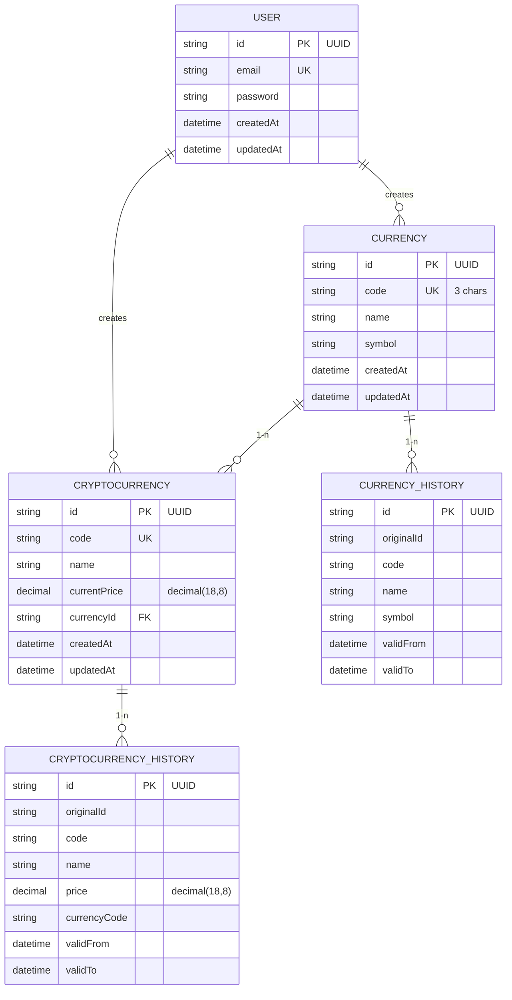

# Estructura de Base de Datos - Plataforma de Criptomonedas

## Diagrama Entidad-Relación



### Descripcion detallada de las tablas

# Tabla User
```
CREATE TABLE "user" (
  "id" uuid PRIMARY KEY,
  "email" varchar UNIQUE NOT NULL,
  "password" varchar NOT NULL,
  "createdAt" timestamptz NOT NULL DEFAULT now(),
  "updatedAt" timestamptz NOT NULL DEFAULT now()
);
```

# Tabla Currency
```
CREATE TABLE "currency" (
  "id" uuid PRIMARY KEY,
  "code" varchar(3) UNIQUE NOT NULL,
  "name" varchar NOT NULL,
  "symbol" varchar NOT NULL,
  "createdAt" timestamptz NOT NULL DEFAULT now(),
  "updatedAt" timestamptz NOT NULL DEFAULT now()
);
```


# Tabla Criptocurrency
```
CREATE TABLE "cryptocurrency" (
  "id" uuid PRIMARY KEY,
  "code" varchar(10) UNIQUE NOT NULL,
  "name" varchar NOT NULL,
  "currentPrice" decimal(18,8) NOT NULL,
  "currencyId" uuid NOT NULL,
  "createdAt" timestamptz NOT NULL DEFAULT now(),
  "updatedAt" timestamptz NOT NULL DEFAULT now(),
  FOREIGN KEY ("currencyId") REFERENCES "currency" ("id") ON DELETE CASCADE
);
```


# Tabla Currency History
```
CREATE TABLE "currency_history" (
  "id" uuid PRIMARY KEY,
  "originalId" uuid NOT NULL,
  "code" varchar(3) NOT NULL,
  "name" varchar NOT NULL,
  "symbol" varchar NOT NULL,
  "validFrom" timestamptz NOT NULL,
  "validTo" timestamptz,
  FOREIGN KEY ("originalId") REFERENCES "currency" ("id")
);
```


# Tabla Criptocurrency History
```
CREATE TABLE "cryptocurrency_history" (
  "id" uuid PRIMARY KEY,
  "originalId" uuid NOT NULL,
  "code" varchar(10) NOT NULL,
  "name" varchar NOT NULL,
  "price" decimal(18,8) NOT NULL,
  "currencyCode" varchar(3) NOT NULL,
  "validFrom" timestamptz NOT NULL,
  "validTo" timestamptz,
  FOREIGN KEY ("originalId") REFERENCES "cryptocurrency" ("id")
);
```


### Relaciones Clave

# User-Currency:

Un usuario puede crear múltiples monedas fiduciarias

Relación implementada a nivel de aplicación (no FK en BD)

# Currency-Cryptocurrency:

Una moneda fiduciaria puede tener múltiples criptomonedas asociadas

Relación 1-n con FK en cryptocurrency.currencyId

# Históricos:

Cada tabla principal tiene su tabla histórica

Relación por originalId que apunta al registro original

Campos validFrom y validTo para control de versiones


### Indices clave
```
-- Índices para currency
CREATE INDEX "IDX_CURRENCY_CODE" ON "currency" ("code");

-- Índices para cryptocurrency
CREATE INDEX "IDX_CRYPTO_CODE" ON "cryptocurrency" ("code");
CREATE INDEX "IDX_CRYPTO_CURRENCY" ON "cryptocurrency" ("currencyId");

-- Índices para históricos
CREATE INDEX "IDX_CURRENCY_HISTORY_ORIGINAL" ON "currency_history" ("originalId");
CREATE INDEX "IDX_CRYPTO_HISTORY_ORIGINAL" ON "crypto_history" ("originalId");
CREATE INDEX "IDX_HISTORY_VALIDITY" ON "crypto_history" ("validFrom", "validTo");
```

### Políticas de Datos


# Eliminación:

Eliminar una currency elimina en cascada sus cryptocurrency

Los históricos se mantienen con originalId apuntando a registros eliminados

# Replicación:

Datos se copian a tablas históricas diariamente

Registros históricos nunca se eliminan (sólo se marcan con validTo)

# Integridad:

Restricciones UNIQUE en códigos de moneda y criptomoneda

Todas las relaciones con integridad referencial